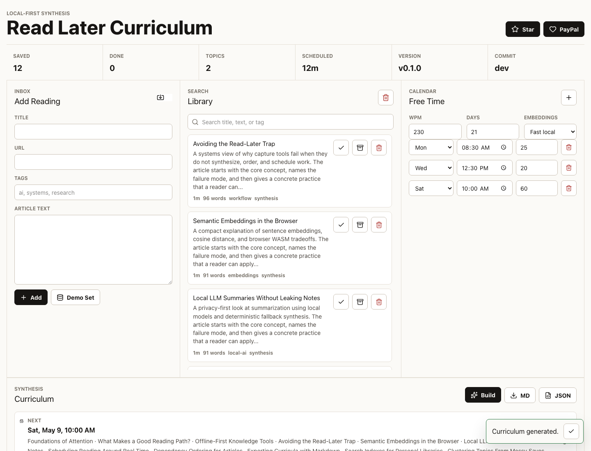
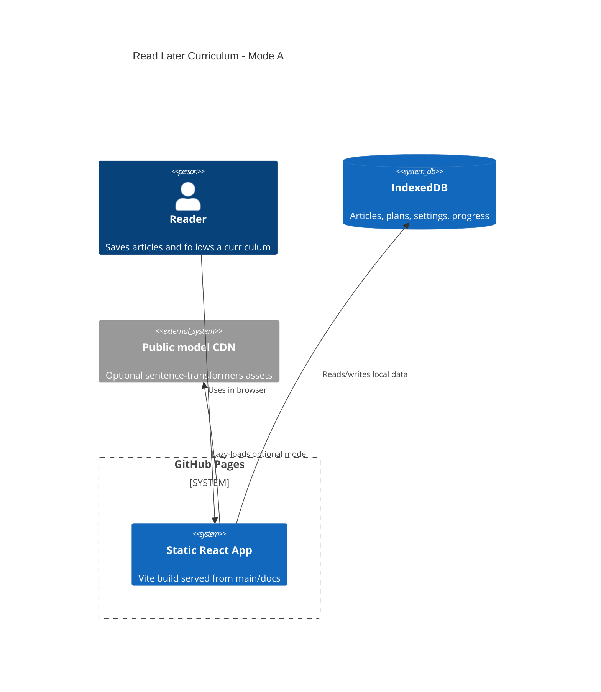

# Read Later Curriculum

Live site: https://baditaflorin.github.io/read-later-curriculum/

Repository: https://github.com/baditaflorin/read-later-curriculum

Support: https://www.paypal.com/paypalme/florinbadita


Read Later Curriculum is a local-first browser app that turns saved article
backlogs into a topic-clustered, dependency-ordered, time-boxed reading plan.
The problem was never saving links. It was synthesis.



## Quickstart

```sh
npm install
make data
make build
make pages-preview
make smoke
```

## What Works

- Add pasted article text or import `.txt`, `.md`, `.html`, and compatible
  `.json` exports.
- Store articles, reading state, settings, and generated plans in IndexedDB.
- Search locally with FlexSearch.
- Build topic clusters with fast local embeddings or lazy browser
  sentence-transformers.
- Dependency-order topics, mix short and long reads, and schedule sessions into
  free-time slots.
- Export curriculum JSON and Pandoc-ready Markdown.
- Show live version and commit in the GitHub Pages UI.

## Architecture



More detail: docs/architecture.md

## Project Links

- Live Pages URL: https://baditaflorin.github.io/read-later-curriculum/
- GitHub repository: https://github.com/baditaflorin/read-later-curriculum
- PayPal: https://www.paypal.com/paypalme/florinbadita
- ADRs: docs/adr/
- Deploy notes: docs/deploy.md
- Data contract: docs/data.md
- Privacy: docs/privacy.md

## Local Hooks

```sh
make install-hooks
```

The hooks run formatting, linting, type checks, tests, Pages build validation,
smoke tests, Conventional Commit validation, and `gitleaks protect --staged`.

## Release

```sh
make release
git push origin main --tags
```

Version is sourced from `package.json`. Commit is embedded from
`git rev-parse --short HEAD` at build time.
