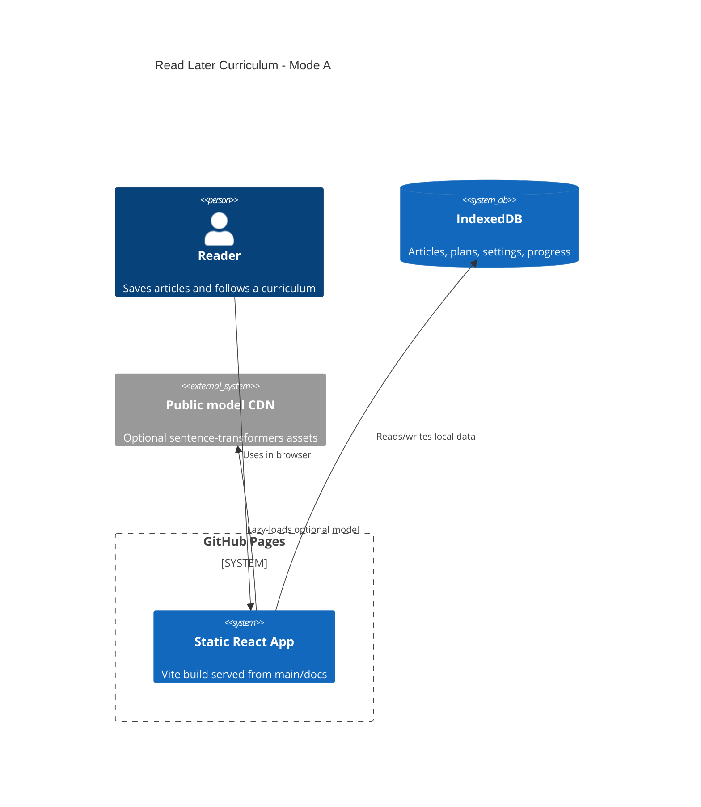

# Read Later Curriculum

Live site: https://baditaflorin.github.io/read-later-curriculum/

Repository: https://github.com/baditaflorin/read-later-curriculum

Support: https://www.paypal.com/paypalme/florinbadita


Read Later Curriculum is a local-first browser app that turns saved article
backlogs into a topic-clustered, dependency-ordered, time-boxed reading plan.
The problem was never saving links. It was synthesis.


## Quickstart

```sh
npm install
make data
make build
make pages-preview
make smoke
```

Canonical user loop:

1. Import your own files, drag a batch onto the page, or paste article text/HTML.
2. Click `Build` to generate the curriculum.
3. Export `Markdown`, `Plan JSON`, or `State JSON`.
4. Reopen later by importing `State JSON` or, for small workspaces, using `Share URL`.

## What Works

- Add pasted article text/HTML, read from the clipboard, drag/drop files, or
  import `.txt`, `.md`, `.html`, read-later `.csv`, RSS/Atom `.xml`, and
  compatible `.json` exports.
- Detect common real-world input shapes, show confidence/warnings, and reject
  unsupported PDFs or empty files with actionable recovery text.
- Store articles, settings, generated plans, manual draft fields, paste buffer,
  and query state in IndexedDB.
- Search locally with FlexSearch.
- Build topic clusters with fast local embeddings or lazy browser
  sentence-transformers.
- Dependency-order topics, mix short and long reads, and schedule sessions into
  free-time slots.
- Export plan JSON, full workspace state JSON, and Pandoc-ready Markdown with
  provenance, version, commit, confidence, and parser metadata.
- Restore a whole workspace from state JSON and share smaller snapshots by URL.
- Print a clean reading-plan view from the browser.
- Show live version and commit in the GitHub Pages UI.
- Inspect import decisions with `?debug=1`.

## Limitations

- Direct URL fetching is intentionally out of scope in Mode A. Paste content or
  import exported files instead.
- Large workspaces do not fit in share URLs and should use `State JSON`.
- The app tracks article status and session continuity, not deep per-paragraph
  reading analytics.

## Architecture



More detail: docs/architecture.md

## Project Links

- Live Pages URL: https://baditaflorin.github.io/read-later-curriculum/
- GitHub repository: https://github.com/baditaflorin/read-later-curriculum
- PayPal: https://www.paypal.com/paypalme/florinbadita
- ADRs: docs/adr/
- Deploy notes: docs/deploy.md
- Data contract: docs/data.md
- Privacy: docs/privacy.md

## Local Hooks

```sh
make install-hooks
```

The hooks run formatting, linting, type checks, tests, Pages build validation,
smoke tests, Conventional Commit validation, and `gitleaks protect --staged`.

## Release

```sh
make release
git push origin main --tags
```

Version is sourced from `package.json`. Commit is embedded from
`git rev-parse --short HEAD` at build time.
