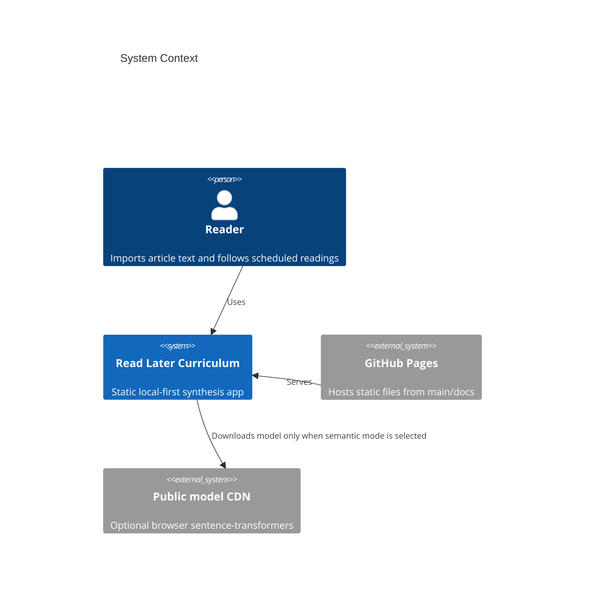
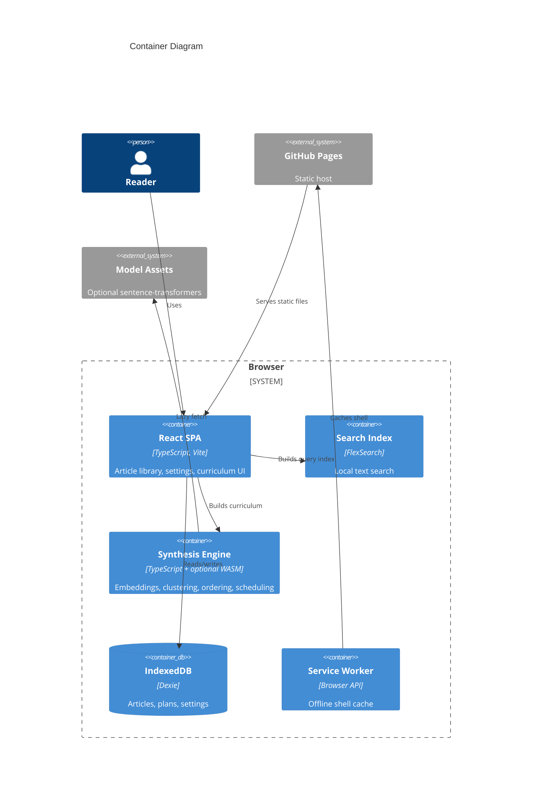

# Architecture

Read Later Curriculum is Mode A: Pure GitHub Pages.

## Context

## Containers

## Module Boundaries

- `src/features/articles/`: importers, validation, normalization.
- `src/features/storage/`: Dexie database and persistence methods.
- `src/features/search/`: FlexSearch wrapper.
- `src/features/curriculum/`: embeddings, clustering, ordering, scheduling,
  export.
- `src/shared/`: constants, types, text utilities.

## GitHub Pages Boundary

GitHub Pages serves static files only from `main/docs`. It does not run server
code, set secrets, process article content, or expose runtime APIs.
